<p align="center">
  
</p>

# DUCAT

A peer-to-peer proximity commerce protocol: **Veilid** for transport, **Monero**
for settlement, **no operator in between**. There is no DUCAT server anywhere —
contacts, messages, bills and receipts are DHT records and end-to-end sealed
payloads, and every phone runs a full Veilid node, giving back the routing and
storage it takes.

**[`ducat-protocol.md`](ducat-protocol.md) is the specification** and the primary
artifact here. Everything else exists to keep it honest.

## Install

**Android** — phone browser, newest build, no release page to navigate:

    https://github.com/KaraZajac/DUCAT/releases/latest/download/app-arm64-v8a-debug.apk

Use `armeabi-v7a` only for phones older than about 2016; `x86_64` is for emulators.

**DUCAT on a desktop** — the same application on a bigger screen, and a shopkeeper's window:

| | |
|---|---|
| Linux | [`.deb`](https://github.com/KaraZajac/DUCAT/releases/latest/download/ducat-linux-x64.deb) · [`.rpm`](https://github.com/KaraZajac/DUCAT/releases/latest/download/ducat-linux-x64.rpm) · [portable](https://github.com/KaraZajac/DUCAT/releases/latest/download/ducat-linux-x64.tar.gz) |
| Windows | [`.msi`](https://github.com/KaraZajac/DUCAT/releases/latest/download/ducat-windows-x64.msi) · [portable](https://github.com/KaraZajac/DUCAT/releases/latest/download/ducat-windows-x64.zip) |
| macOS (Apple Silicon) | [`.dmg`](https://github.com/KaraZajac/DUCAT/releases/latest/download/ducat-macos-arm64.dmg) · [portable](https://github.com/KaraZajac/DUCAT/releases/latest/download/ducat-macos-arm64.tar.gz) |
| macOS (Intel) | [`.dmg`](https://github.com/KaraZajac/DUCAT/releases/latest/download/ducat-macos-x64.dmg) · [portable](https://github.com/KaraZajac/DUCAT/releases/latest/download/ducat-macos-x64.tar.gz) |

Each carries its own Rust library and JVM — nothing to install first. They are
unsigned, so both desktop OSes will warn on first open.

**Debug-signed, stagenet only.** Not for real money.

## Setting up takes about a minute

Five steps, no account, nothing to sign up for. Every screenshot below is the
app running on a phone, not a mockup.

<p align="center">
  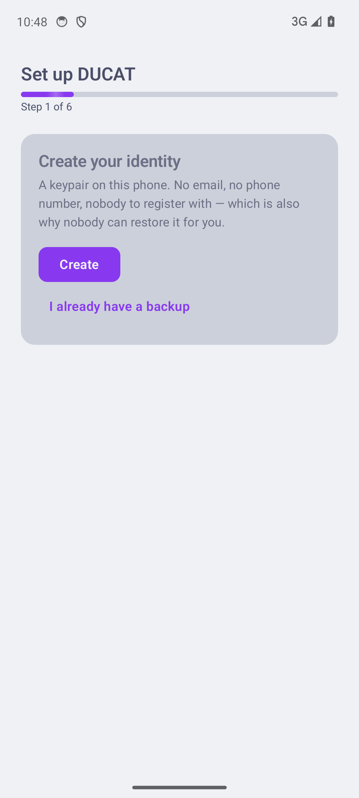
  &nbsp;
  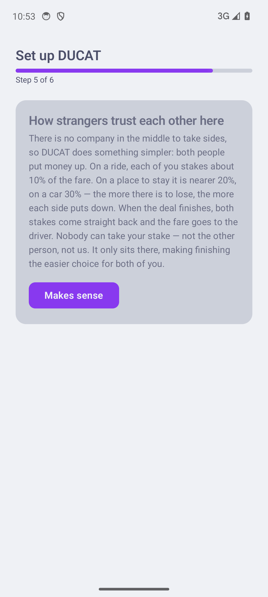
  &nbsp;
  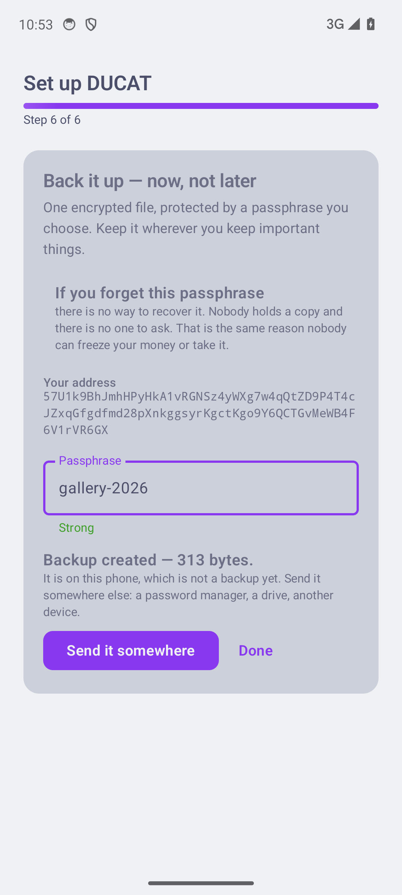
</p>

Your identity is a keypair made on the phone — no email, no phone number, nobody
to register with, *which is also why nobody can restore it for you*. The app
says that out loud rather than burying it, and the last step is the backup,
because a wallet you cannot restore is the one way a person actually loses
money here.

## Money that is yours

<p align="center">
  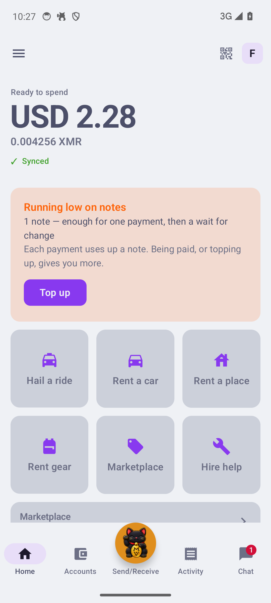
  &nbsp;
  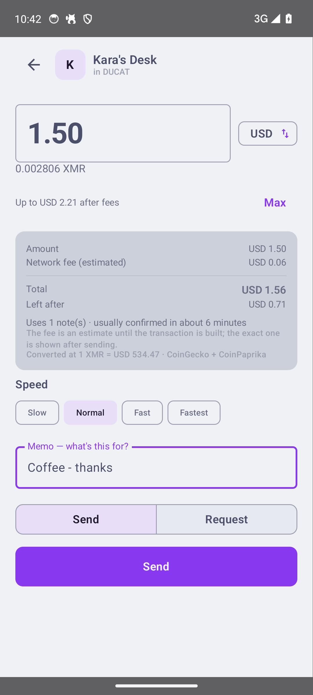
  &nbsp;
  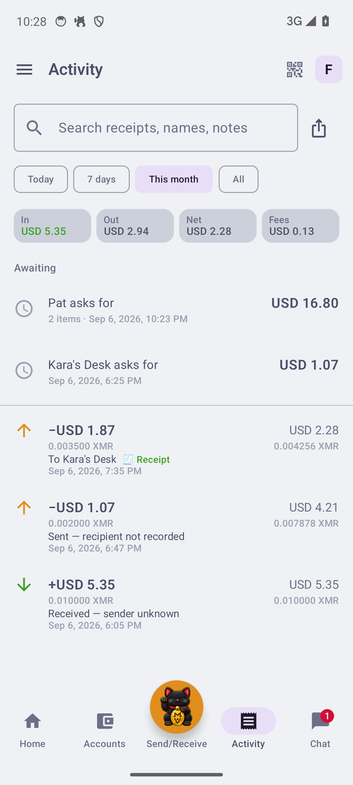
</p>

A self-custodial Monero wallet with fiat conversion throughout. Paying shows the
whole arithmetic before you commit — amount, the estimated network fee, the
total, **what you have left afterwards**, how many notes it spends and roughly
how long it will take — and lets you pick a speed. The history is rebuilt from
the chain: sends identified by key image, change never shown as income, every
row carrying the running balance so the statement and the balance screen can be
checked against each other.

Monero spends discrete notes rather than a balance, so a wallet holding one big
note can be unable to pay twice in a row. That is the red banner on the left:
the app counts the notes it can spend and tells you to break one **before** you
are standing at a counter, rather than failing there.

## People, and conversations that carry money

<p align="center">
  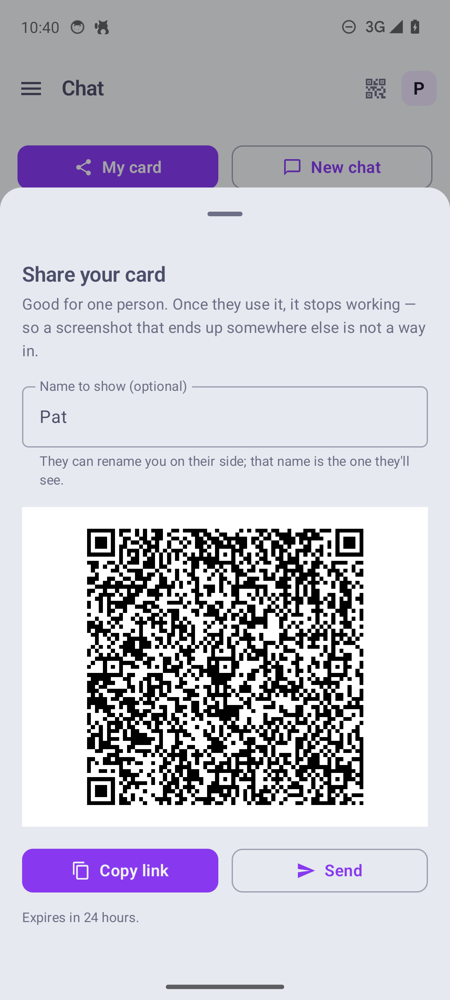
  &nbsp;
  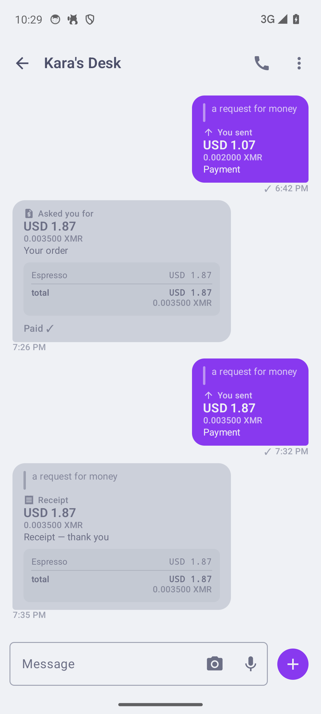
</p>

A contact is a keypair, not an identifier. You hand someone a card — by QR,
`ducat:` link, or an **NFC tap** — and it is *good for one person*: once claimed
it stops working, so a screenshot that ends up somewhere else is not a way in.
One scan opens a mailbox-based conversation that works while either side is
offline.

Those conversations carry commerce, not just text: itemised bills whose lines
**must** sum to their total or the message is refused, payments, and receipts
issued by the payee pointing at the transaction they acknowledge. Encryption is
X3DH-shaped with one-time prekeys and forward secrecy — and when the app has to
fall back to the signed prekey it shows you an open lock rather than hiding it.

## A ride, with nobody dispatching it

<p align="center">
  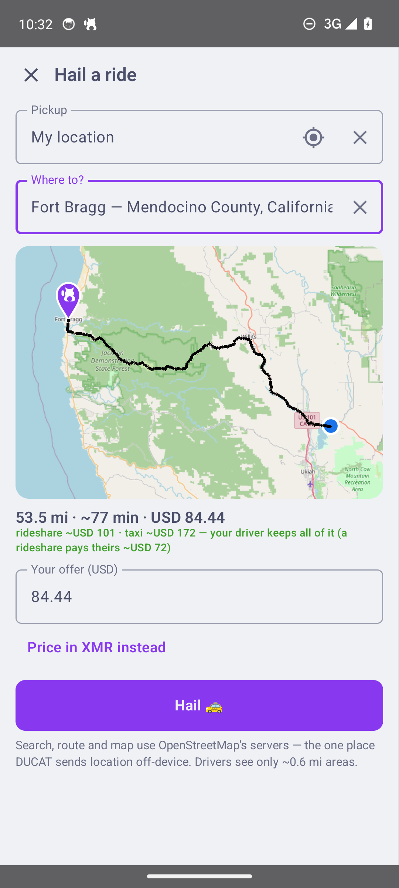
</p>

Type where you are going. Your phone turns a GPS fix into a geocell — a public
bulletin board *whose address is the place itself* — and posts a hail: a
claim-once card, a destination, and an offer priced from the real driving route.
Drivers watch their cell and its neighbours and claim it; the DHT referees the
race, and no matchmaker exists.

The green line is the point. DUCAT's rates sit about 15% under a rideshare's
rider-side rates — on this short trip its fare floor puts it further under still,
$6.00 against about $9 — **and the driver keeps all of it**, where a rideshare
would have paid them roughly 71% of what the rider handed over. Pricing inside
that gap is what lets the rider pay less *and* the driver earn more at the same
time; it is the absent platform cut, handed to both of them. Acceptance arrives
with a face on it: name, car, colour, plate, ETA.

One trade, stated plainly on the screen: address search, routing and map tiles
query OpenStreetMap's servers — the single place DUCAT sends location
off-device. The boards themselves never carry better than ~1.2 km.

## Your phone is the whole business

<p align="center">
  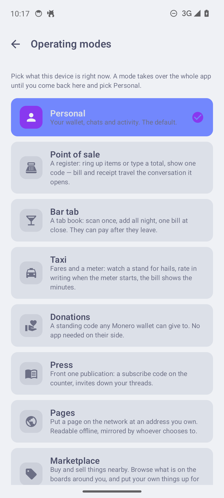
  &nbsp;
  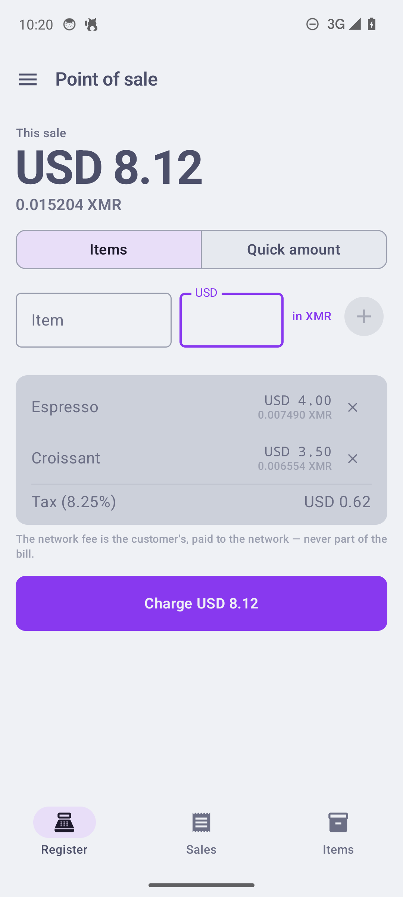
  &nbsp;
  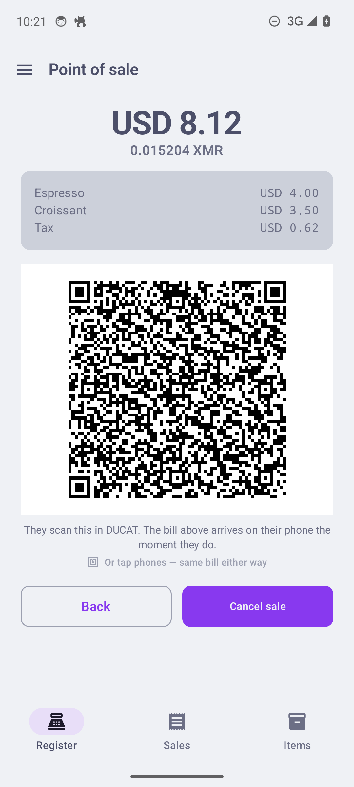
</p>

Pick a mode and the entire app hands over — its own tabs, nothing of the
wallet's. A **point of sale** rings up items or takes a typed total and shows
one code; the bill arrives on the customer's phone the moment they scan it, and
a receipt goes back when they pay. A **bar tab** pings every drink to the
customer and closes with one bill they can settle from the bus home. A
**donation box** is a standing address any Monero wallet can give to, with its
linkability cost stated on screen.

<p align="center">
  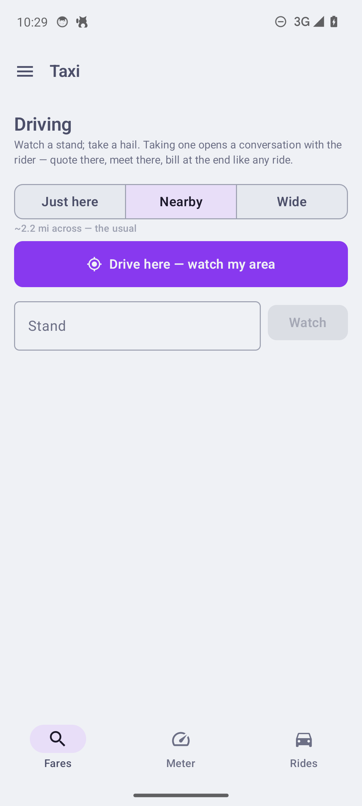
</p>

**Taxi** mode is a driver's whole day: choose how wide an area to watch, take a
hail, run the meter, and see today's take. Almost none of this needed a new wire
object — the spec's proudest sentence.

## Renting out a room or a car

<p align="center">
  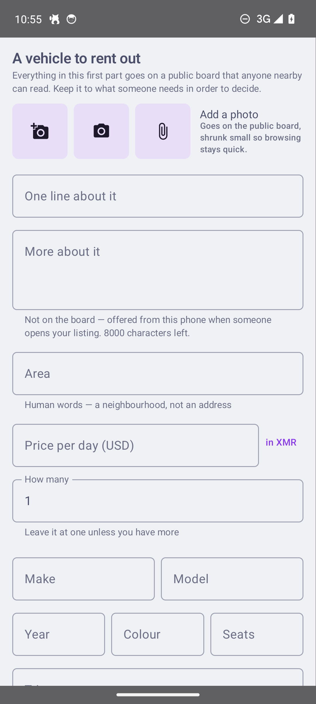
  &nbsp;
  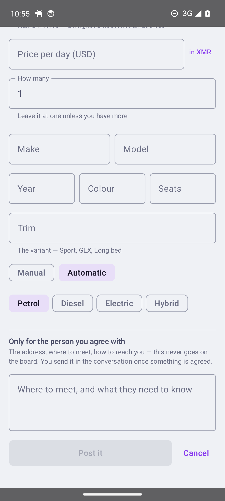
  &nbsp;
  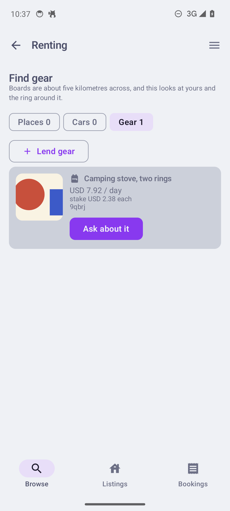
</p>

Listings work like hails, on coarser boards — about five kilometres across,
because people will travel to collect a set of keys. The form is split in two
and the app tells you which half is which: everything in the first part **goes
on a public board that anyone nearby can read**, and the address, where the keys
are, and the plate go in the second, which never leaves your phone until a
booking is real.

Searching reads your board and the ring around it, showing what it finds as each
board answers. What comes back is enough to decide on — make, model, year,
gearbox, fuel, price and the stake — plus a card to open a conversation with.

## Why a stranger can trust you

There is no company in the middle to take sides, so DUCAT does something
simpler: **you both put up a stake, and finishing gives it back.**

Each side stakes a share of the price — about **10% on a ride, 20% on a place to
stay, 30% on a vehicle**, because the more an asset can be damaged beyond its
rental price, the more each side puts down. Finish and both stakes come home;
the fare goes to the driver. Nobody can take a stake, including us: the money
sits in an address only the two of them can open, and the release hands each
side their own back by name. The phone explains this before your first deal —
it is the fourth screen you ever see.

Those numbers are argued rather than guessed. Bisq is the closest working
precedent — 2-of-2 with no custodian, deposits from both sides, a 15% floor and
a 50% ceiling, chosen expressly so cooperation is likely *without* a reputation
system, which is a privacy cost DUCAT also declines. The dual-deposit literature
proves the arrangement cheat-proof at equilibrium but derives no optimum, so the
ceiling comes from practice, where large deposits are known to price people out.
Two bounds fall out: a stake worth less than the fee to return it becomes zero
rather than decoration, and none exceeds half the price. The exposed side funds
second — the payer carries the price *and* a stake, so their money never sits
alone in a shared address.

When a deal wants more than that, **escrow with no company behind it (§17.9)**:
rider, driver and a mutually trusted arbiter contact run a distributed key
generation over the sealed thread — three devices derive one Monero address,
each holding only a share, any two able to sign, no dealer anywhere. The happy
path is two taps. Anything else is a settlement — either side proposes a split,
the other signs or counters. A stranded party asks the arbiter, whose
co-signature *is* the ruling; a captured arbiter can at worst pick between the
named parties, never pay itself. Chain-proven on stagenet in every shape,
including a two-input FROST release.

## It tells you what things cost you

<p align="center">
  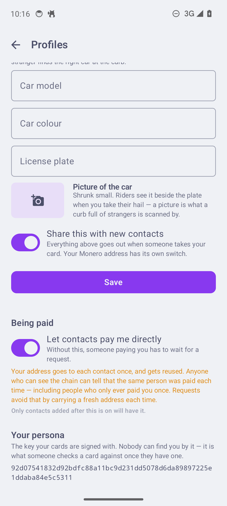
</p>

Convenience has a price in a privacy system, and the app names it at the moment
you choose rather than in a policy nobody reads. Letting contacts pay you
directly means reusing one address — so it says that anyone watching the chain
can tell the same person was paid each time, *including people who only ever paid
you once*, and points at the alternative. The same habit runs through the app:
a mempool sighting is shown as *seen, never settled*; a profile is always
presented as the **claim** it is; a donation address states its linkability cost
on screen.

## And it behaves like an app

Notifications that hide amounts from the lock screen and deep-link into the
thread they announce, unread badges, an encrypted backup that carries the
*people* (contacts, outbox keys, prekeys, chain counters) as well as the money,
a staleness nudge when contacts outgrow the last export, redacted
crash-surviving logs, and a torch on the scanner — because codes get scanned
across dark bars. It speaks twenty languages — every screen reads from
resources, plurals are composed rather than concatenated, and Arabic and Farsi
prove the mirror.

Receipts are records, not messages: every receipt lives in its own store,
survives thread and contact deletion, and rides the backup. The memo travels in
the sealed notice — never on the chain, because a public memo is a note stapled
to a banknote.

## The repository

```
ducat-protocol.md   the spec — draft 0.88, changelog first
core/               reference implementation (Rust)
vectors/            328 conformance cases + schema — the published artifact
conformance/        four checkers: schema, second implementation, spec audit,
                    declared dependencies
harness/            end-to-end over real Veilid routes and real settlement
sim/                offline simulator and market scenarios
applications/       every client: android/ (Kotlin/Compose over a UniFFI
                    bridge) and desktop/, which compiles the same protocol
                    sources verbatim into DUCAT Desk for Linux/Windows/macOS
                    — it has played bar counter, driver, and standing escrow
                    arbiter. iOS gets a folder when it earns one.
mobile/             the Rust bridge: wallet, scanner, mailbox, node
research/           one-off measurements: Veilid throughput, Monero multisig,
                    FROSTLASS, wallet-layer probes. Evidence, not product.
```

## Checking it

```sh
python3 -m pip install -r conformance/requirements.txt   # once
cargo test --workspace                      # core, sim, harness
python3 conformance/validate_vectors.py     # every vector against schema.json
python3 conformance/ducat_check.py          # a second implementation runs them
python3 conformance/audit_spec.py           # the document against the code
python3 conformance/check_requirements.py   # nothing imported goes undeclared
```

All of it runs on every push (`.github/workflows/checks.yml`), together with
both clients' builds and a render of every desk screen.

The last one exists because prose drifts from code silently — a stale sentence
throws no exception. It has caught a normative section that was referenced three
times and never written, a field range the registry did not declare, and six
vector kinds the document never named.

## On the shoulders it stands on

DUCAT rides [Veilid](https://veilid.com), a network built by people who
explicitly refused to monetize one, and treats that as a **dependency, not a
coincidence** — the spec's stewardship section (§18.7) makes it normative: no
protocol fees, no node payment, ever; every client a full participant; records
minted for live purposes and forgotten when spent. The delivery model follows
[VeilidChat](https://veilid.com)'s published corrections rather than repeating
its mistakes, and says so in the changelog. Settlement is
[Monero](https://www.getmonero.org), scanned and spent by an embedded
[monero-oxide](https://github.com/monero-oxide/monero-oxide) wallet — no
`wallet-rpc` daemon on the phone.

## What is proven, and what is not

Demonstrated end to end on stagenet, over live private routes: `direct`, `fast/1`
and escrow settlement; card exchange and claim in both directions (as URIs —
never yet over NFC); ten attacks refused; the abandonment paths that leave a
single-sided receipt; the bar-tab flow phone-to-desktop, bill to receipt; and
two complete dispatched rides phone↔desktop — geocell hail to on-chain
settlement with tip and receipt, the second without a single lost message.
And the escrow arc: two phones and a desk arbiter built a 2-of-3 over the
mailbox and independently derived one address; a bonded hail ran fund →
fare-secured-by-own-scan → consent release → broadcast, driver paid. Every
release shape is a distinct transaction verified on-chain through the one
shipping engine: the plain sweep, the split, the arbiter ruling signed with
the funder absent, and a reservation's two-input release spending both
parties' stakes at once. Renting was proven the same way: two unrelated desks,
one posting and one searching, converging on a board addressed by the
neighbourhood — including the overflow ladder, where thirteen cars spread
across two shards of a full board and a stranger found every one of them. And
then from a phone: a handset that had never heard of the seller opened Rent a
car, had the listing on screen in under six seconds, tapped Ask about it, and
had claimed the card and delivered its question 1.2 s later. The bonded ride
has now been driven to the end on two phones as well — the driver proposing
the split, the rider signing it on the screen that asks, the bond broadcast
and both stakes home. And a **booking**, which had never been driven at all:
two clients, one card, one escrow address each side derived independently,
the owner accepting by funding their own deposit (0.000600), the guest paying
rent and theirs (0.002600), the pot confirmed at 0.003200 by the guest's own
scan rather than anyone's word, and — after the outputs matured — the owner
proposing the split, the guest signing it, the release broadcast, both sides
whole. It resumed the escrow rather than starting a second one when a Monero
node timed out mid-run, which is the behaviour a phone that loses signal
halfway through a booking needs.

Not proven, and stated here rather than buried: **no external adversarial
review** (§2.5 is the project's own argument for why that matters), no
implementer who has never read `core/` (O21), NFC compile-verified but never
field-tested between two phones, and no measurement of the tap on a handset.
The latency figures in §8.7.2 are a desktop with an attached node. The
booking arc above ran between two headless clients; **its screens have since
carried one** — on 2026-08-25 two emulators on the live network and live
stagenet ran a marketplace sale (`284eb311`) and a two-day gear hire
(`709f4d38`) entirely through the UI, and a hail was driven rider-to-driver
the same way, hail to release (`112e0983`). What that does not answer is a
handset: two radios, two batteries, two independent clocks. The settlement
UI's counter-offer ran for the first time on 2026-08-25 (`74bc40b9`), and a
counter to a counter the same day — four proposals deep, settled at the
countered figure (`ba8f17f6`). **Backup and restore ran the whole way on
2026-08-26** — export, wipe, restore, and the phone came back with its
persona, contacts, threads, shop and till, then sent and received again —
which leaves only the OEM file picker as the untested part. **Live
position (§15.12) ran the same day** (`3382f6e3`): offered after the
accept and nowhere else, read, rendered, aged into "last seen N seconds
ago" when the sender left the screen, released when the sender stopped,
and swept off both phones by the poller when the ride settled — with the
one thing an emulator cannot judge, a dot that actually moves, left to
the field day, because `adb emu geo fix` reports OK and changes nothing. A co-signer today
consents to a stated fee, not an itemised destination list — honest consent
waits on an upstream wallet API making payments readable.

A driver's watches did not work for the whole life of the feature, which is
worth stating plainly because it was invisible: arming one requires the DHT
record to be open in this process, a board is never open, so the network
refused every watch with "record not open" and the return value was
discarded. Every fare any driver ever saw was found by the sweep, a lap late.
It is fixed and measured (`:desktop:watchtest`): a notice posted to a watched
board rings the watcher 10.7 s after the write lands, and the ring now names
which board changed, so a driver reads that one instead of all eighteen.
Searching a quiet neighbourhood is bounded, and the screen says so while it
happens. Measured against the live network from a node with nothing else to
do: a board somebody has posted to answers in 1.1 s, and an empty one takes
21.0 s — flat, to the millisecond, across eight different empty boards,
because that number is the DHT giving up rather than searching. A search
reads your own cell first and then the ring of eight around it, drawing each
as it lands, so a car parked near you is on screen in under six seconds while
"nothing listed around here" takes about forty and counts the areas off as it
goes.

## License

[BSD-3-Clause](LICENSE) — the same license as Monero. Note that §18.7's
obligations (no carriage fees, full participation) are conformance
requirements of the *protocol*, not terms of the license: build anything you
like from this code, but a client that monetizes carriage is not DUCAT.
